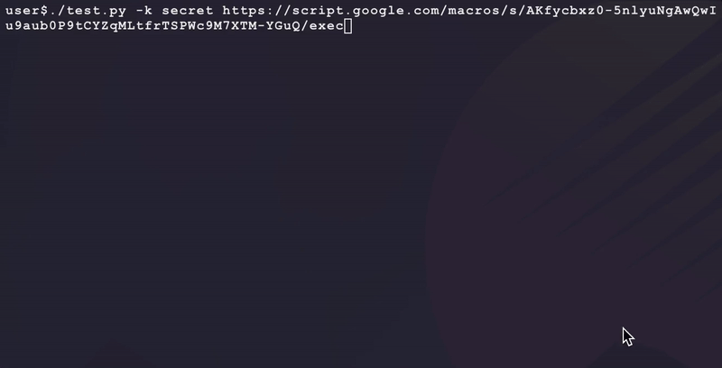
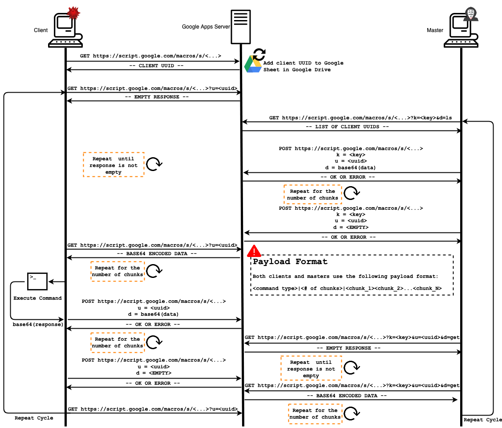
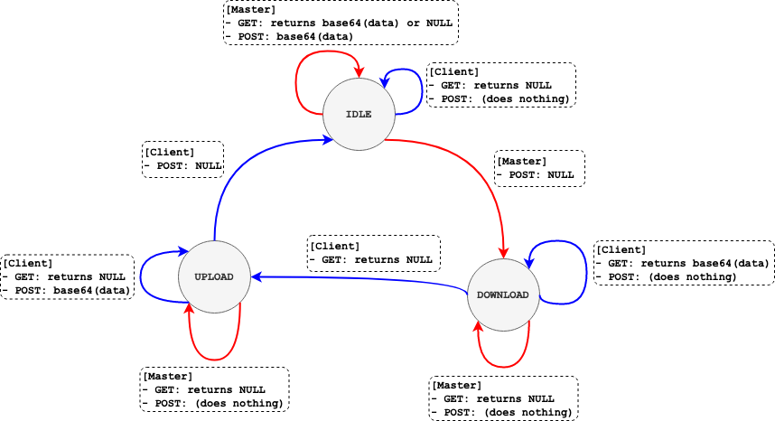
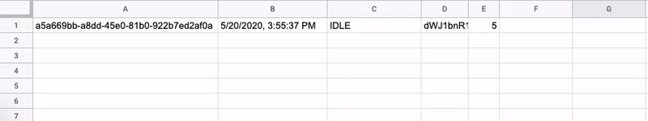
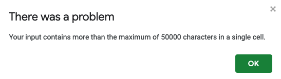

# `google_RAT`
 

A remote access tool using [Google Apps Script](https://developers.google.com/apps-script) as the middle-man for command and control.

## TODO

- [ ] Support multiple masters. Any given HTTP POST/GET request from a master can fail due to another master or server having modified the Google Sheets database first for a specific client.
- [ ] Support built-in key logging for each client type. Depending on the client type and OS platform, the ability to log user keystrokes changes.
- [ ] Support built-in screenshot capture for each client type. Depending on the client type and OS platform, the ability to capture a screenshot image changes.
- [ ] Update C2 diagram to remove number of chunks from payload format.

## Dependencies

**NOTE:** These only apply to running `master.py` and `test.py` on _your_ local machine. Client dependencies (if any) are listed in each [client's](./client) README.

- [Python3](https://www.python.org/downloads/)
- [Requests](https://requests.readthedocs.io/en/master/) (`pip3 install requests`)

## Setup

### :one: Deploy Google Apps Script C2 Server

* Create a fake Google account (https://accounts.google.com/signup)
* Create a new empty spreadsheet in the fake account's Google Drive (https://drive.google.com)
* Make this new spreadsheet public and openly editable by link:
  * File > Share > Get Link > Change > Anyone with the link > Viewer > Editor
* Paste the new spreadsheet's link into the `SPREADSHEET_URL` variable in `server.js` _and_ define a secret value for `MASTER_KEY`.
  * **NOTE:** Remove `?usp=sharing` at the end of the `SPREADSHEET_URL`. The URL should end in `/edit` only.
* Visit Google App Scripts (https://www.google.com/script/start/) and make a new project under your new Google account:
  * Start Scripting > New Project
* Paste your formatted code from `server.js` and save the project
* Publish the server:
  * Publish > Deploy as web app
    * Fill in the blank with something
    * Make sure the app is executed as `Me`
    * Make sure `Anyone, even anonymous` can access the app
  * Click `Deploy`
  * Review Permissions > Select your fake account > Advanced > Go to Untitled project (unsafe) > Allow
  * **Save the application URL** (it should end in `/exec`). This is what the clients and master will connect to.

### :two: Test Server Connection

- Run [`./client/test.py`](./client/test.py) in order to test your server URL connection and `MASTER_KEY`:

### :three: Select Clients

- Select your [client](./client) and add the Google Apps Server URL from step 1 into the correct payload variable for your client's type as defined in the client's README

### :four: Run Master

- Run the master to interact with clients (_using a Python client in the example below_):

## Command and Control Protocol Notes

_NOTE:_ diagrams made with https://draw.io

- **Transaction Flow:**

- **Client State Transition Diagram:**

- **Example Google Apps Server transaction between a master and client:**

- **General Notes:**
- This design allows for _multiple servers to be ran simultaneously_ against the same backend Google Sheets "database" for client redundancy and availability.
  
- All master requests to the server must present a unique key in order for their request to be processed. This key is hardcoded into each server's JavaScript with the `MASTER_KEY` variable.
  
- Each payload is base64 encoded _except for the the command type_. This is seperated by the `|` character as the delimiter in the payload. 

## Limitations

- All data sent to/from the server is chunked into 50000 (50 KB) chunks. This is because Google Sheets currently has a single cell size limitation of 50000 characters:

- Google applies [daily quotas and limitations](https://developers.google.com/apps-script/guides/services/quotas) for execution of its services. Getting around these limitations is as simple as creating other duplicate copies of the same `server.js` code for more servers in your design. Each client is able to cycle through multiple servers for loadballancing.

